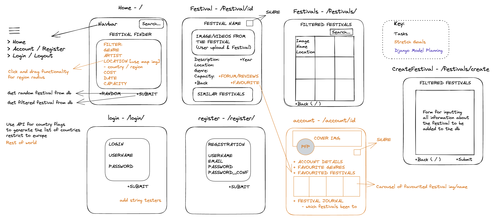
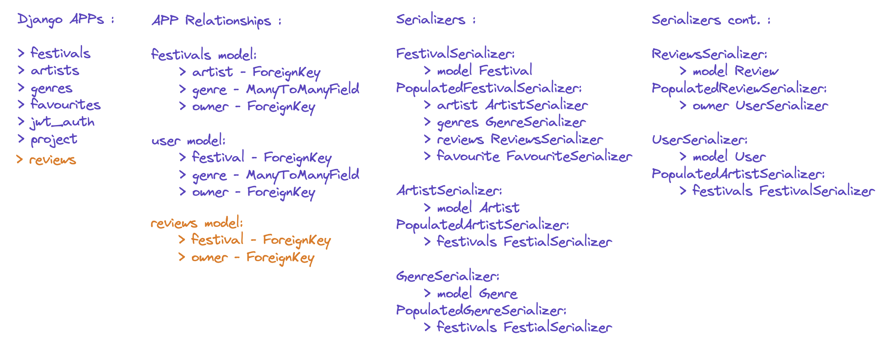

# General Assembly Project Four - Festi: a Python Django API and React App

# Description
This was my final project built on the Immersive Software Engineering course with General Assembly. It was a solo endeavour; all functionality within the site being coded by me from scratch over the course of a week. 

Festi is a full-stack application designed to help users search for new music festivals for the summer months. This is the first project I have built using Django as the backend framework for api routing and using PostGreSQL to create the database of festivals. The app leverages React as a frontend framework and implements Material UI and CSS for styling. 

Please find the full deployment of the app [here](https://festi-front-end.netlify.app/).

# Brief

- Build a full-stack application by making your own backend and your own front-end
- Use a Python Django API using Django REST Framework to serve your data from a Postgres database
- Consume your API with a separate front-end built with React
- Be a complete product which most likely means multiple relationships and CRUD functionality for at least a couple of models
- Implement thoughtful user stories/wireframes that are significant enough to help you know which features are core MVP and which you can cut
- Be deployed online so it's publicly accessible.
- Write your code DRY and build your APIs RESTful.
- Timeframe: 7 days

# Code Installation

Clone the backend repo using the SSH Key contained within the Code button above, then follow the steps below in a local Terminal window:

```sh
git clone <COPIED_SSH_KEY>
cd <Newly cloned git repo>
```
Now you have navigated into the cloned git repo you can run the following commands:

```sh
pipenv install
```
```sh
pipenv shell
```
```sh
python manage.py makemigrations
```
```sh
python manage.py migrate
```
```sh
python manage.py runserver
```

Now you have the backend installed correctly and the server is running we can move onto the frontend:

Navigate to frontend repo [here](https://github.com/wyndhams/ga-project-4-frontend) then clone the repo on your local machine as above. Once you have changed your current directory to the newly cloned repo, use the following commands in your terminal window to install the necessary packages and launch the frontend on a localhost:

```sh
npm install
```
```sh
npm start
```

# Technologies Used
## Backend:
- Python
- Django
- Django REST Framework
- Psycopg2
- pyJWT

## Frontend:
- React
- Axios
- Material UI
- SCSS
- Http-proxy-middleware
- Nodemon
- React Router Dom

## Development tools:
- VS code
- npm
- Git
- Github
- Google Chrome dev tools
- Heroku (deployment)
- Netlify (deployment)
- Trello Board (planning and timeline)
- Excalidraw (wireframing)

# Planning

Once I had developed the initial concept for the application I undertook some market research to understand what products were out there already and what the unique selling point of my application was going to be. I looked at websites such as Resident Advisor, Skiddle and Festival Finder (.eu) for inspiration and to better understand where a niche could be found. As I was perusing these sites my main takeaway was either there were far too many results to choose from or the results that were being displayed when I was filtering for specific genres / artists were not relevant. A lot of festivals that I have been to which I would consider some of the better, albeit smaller, festivals were not showing up or were being lost in a noisy / crowded set of results. 

I therefore set out to create a curated database of festivals, initially for electronic dance music (as this is my own area of interest / passion), that could be perused by an audience to find a new festival for the summer. I also wanted to display information about the festival including location, cost, size, time of year etc. in order for users to make an informed decision. Another concept that I wanted to embed in the design of the application was the ability for users to favourite festivals which could then be displayed in their own account page. 

I was aware that working solo would make some of these targets unachievable given the limited time available so I created a wireframe, as below, of each of the pages and features that I wanted to include and (in orange) stretch targets should I have any addtional time at the end fo the project. I used the free online tool, Excallidraw to create the below wireframe.



Before diving into Visual Studio Code I also had a think about the backend models that I was going to need to create and wrote this down in Excallidraw to explore the different interdependencies. 



# Backend

The backend leveraged the Django REST Framework to build the web browsable API's for the application along with PostgreSQL for working with the database. 

# Frontend

I built the frontend of the application using React and a mix of Material UI and CSS for the styling. 